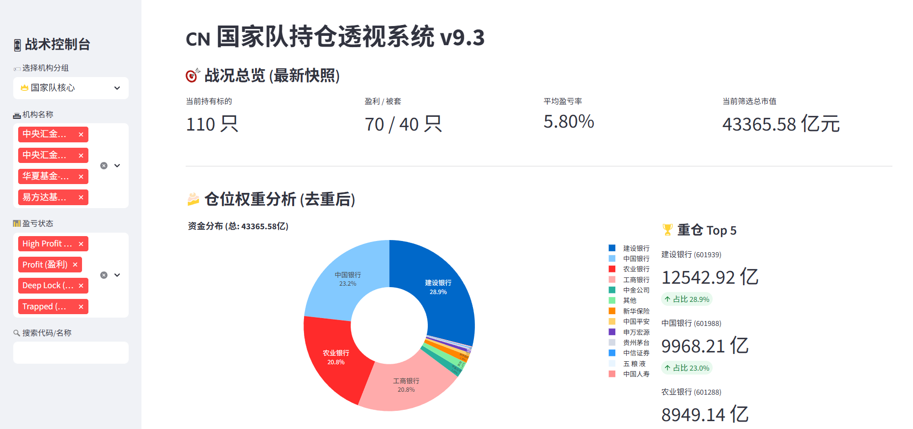

# 🇨🇳 国家队逆向工程指挥部 (National Team Reverse Engineering Dashboard)


**一个基于 Python + Streamlit 的 A 股主力资金监控与持仓分析系统。**

本项目旨在通过公开的财报数据，逆向追踪并可视化“国家队”（中央汇金、证金公司、社保基金、养老金等）的持仓动向、成本分布及盈亏状态，为投资者提供上帝视角的战术参考。

---

## ✨ 核心功能 (Features)

* **🔭 全景透视**：一键查看国家队持仓总市值、胜率及仓位分布。
* **👍 机构指定**：支持自定义抓取指定机构持仓。
* **🧩  智能分组**：支持通过通配符（如 `*汇金*`、`全国社保*`）自定义机构分组，灵活追踪各路主力。
* **📊 成本核算**：通过披露时间段来估算建仓成本（VWAP 区间成本法），区分“底仓”与“新增资金”，精准计算每一笔增持的盈亏。
* **📈 深度集成**：内置 K 线图与技术指标（RSI, MA, Bias），并支持一键跳转东方财富 F10。
* **🚀 极速部署**：支持 Docker 数据库部署与 Streamlit 热重载开发。

## 📸 界面预览 (Screenshots)



---


## 🛠️ 快速开始 (Quick Start)

### 1. 环境准备

确保你的服务器或本地电脑已安装 `Python 3.10+` 和 `Git`。


### 2. 克隆项目

```
git clone [https://github.com/你的用户名/nt_project.git](https://github.com/你的用户名/nt_project.git)
cd nt_project
```


### 3. 安装依赖

建议使用 Conda 或虚拟环境：

```
# 创建虚拟环境 (可选)
conda create -n nt_env python=3.10
conda activate nt_env

# 安装 Python 依赖
pip install -r requirements.txt
```


### 4. 启动数据库

本项目依赖 PostgreSQL 存储持仓数据。

```
# 使用 Docker Compose 启动数据库
docker-compose up -d
```


### 5. 运行 Dashboard

```
streamlit run dashboard.py
```

访问浏览器：`http://localhost:8501` 即可看到指挥部界面。


## 📂 目录结构 (Project Structure)

```Plaintext
nt_project/
├── dashboard.py          # Streamlit 主程序 (Web 界面)
├── analysis_engine.py    # 数据分析核心逻辑
├── etl_ingest.py         # 数据清洗与入库脚本 (ETL)
├── docker-compose.yml    # 数据库容器配置
└── storage/              # [Ignored] 存放数据库文件与本地日志
```


## ⚠️ 免责声明 (Disclaimer)

本项目仅供计算机编程学习和金融数据分析研究使用。项目中涉及的所有数据均来源于互联网公开渠道（如东方财富、AkShare 等）。**作者不对数据的准确性、及时性负责。本项目不构成任何投资建议，投资者据此操作，风险自担。**

This project is for educational purposes in computer programming and financial data analysis only. All data involved comes from public internet sources. **The author is not responsible for the accuracy or timeliness of the data. This project does not constitute any investment advice. Investors operate at their own risk.**


## 📜 许可证 (License)

本项目采用 [Apache License 2.0](https://www.google.com/search?q=LICENSE) 开源许可证。

Licensed under the Apache License, Version 2.0 (the "License"); you may not use this file except in compliance with the License. You may obtain a copy of the License at

```
http://www.apache.org/licenses/LICENSE-2.0
```

Unless required by applicable law or agreed to in writing, software distributed under the License is distributed on an "AS IS" BASIS, WITHOUT WARRANTIES OR CONDITIONS OF ANY KIND, either express or implied. See the License for the specific language governing permissions and limitations under the License.

------

Made with ❤️ by [kitakiのgemini✨]
