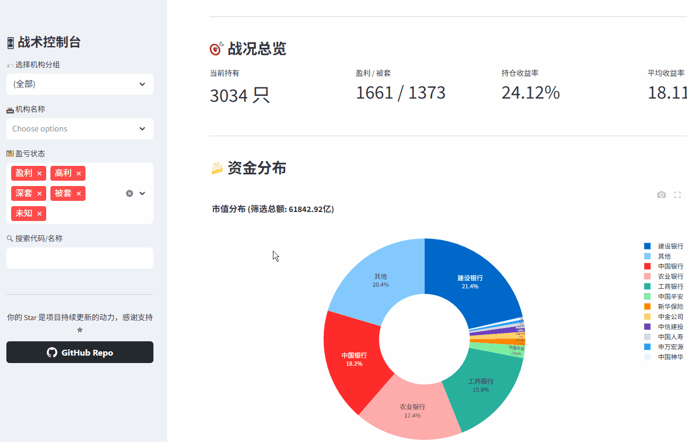
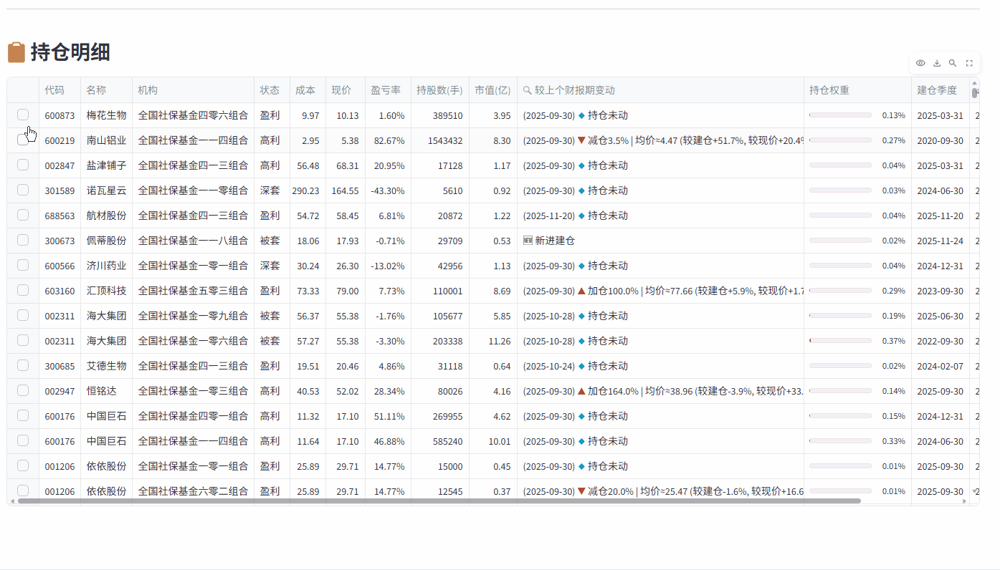
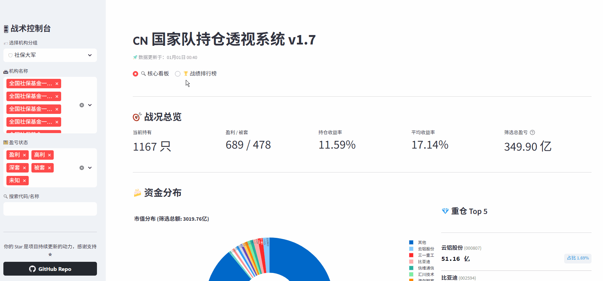
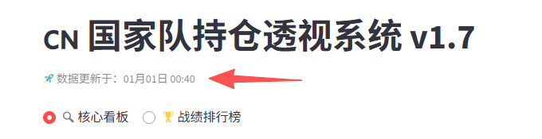
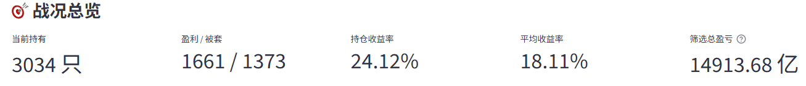
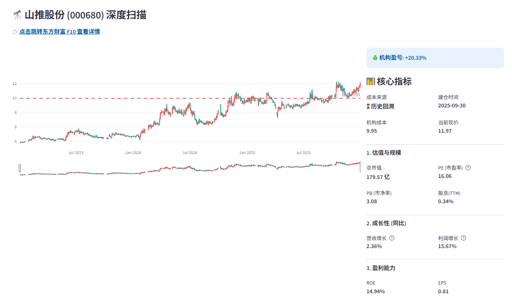

# 🇨🇳 A股国家队持仓透视系统 (CN National Team Position Tracking System)


> **透视“聪明钱”底牌，追踪国家队动向。**
> A data-driven dashboard to track and analyze the positions of China's "National Team" (Huijin, CSF, SSF, etc.).

---


## 📖 项目简介 (Introduction)

本项目是一个基于 Python 全栈开发的量化分析系统，通过公开的财报数据（十大股东/十大流通股东）逆向追踪并可视化 **“国家队”** 资金的持仓动向。根据国家队建仓的季度使用**VWAP 区间成本算法** 估算机构的**建仓成本**与**盈亏状态**，帮助投资者了解国家队当前的持仓状况。使用Docker Compose搭建Postgresql数据库，Streamlit作为前端。

如有遇到问题请提交到**issue**，**使用前请务必阅读完此文档，特别是[数据说明](#关键数据)部分。**

------


## 📂 项目结构 (Structure)

```Plaintext
nt_project/
├── analysis_engine.py      # [核心] 分析引擎：计算成本、盈亏、生成文案
├── batch_history_trace.py  # [核心] 考古挖掘机：全量回溯历史持仓，生成档案
├── etl_ingest.py           # [ETL] 数据采集器：抓取股东、行情、财务指标
├── fix_stock.py            # [工具] 补漏机器人：自动修复缺失或异常的成本数据
├── dashboard.py            # [UI] Streamlit 前端展示层
├── update_data.sh          # [脚本] 一键更新自动化脚本
├── .gitignore              # 排除storage/以及一些其他的临时文件
├── docker-compose.yml      # 数据库容器配置
├── debug                   # 进行开发时调试的debug文件
└── storage/                # 本地日志与数据库 (Git ignored)
```

---


## 🚀 功能与使用指南 (Features & Usage)

### 1. 🎛️ 战术控制台：精准筛选主力
位于左侧的控制台是您的指挥中心。您可以灵活组合筛选条件，快速定位特定的资金流向。

* **机构分组**：按“国家队核心”（汇金/证金）、“社保大军”（全国社保基金）、“养老战队”（基本养老保险基金）等预设组进行一键筛选。
* **多维过滤**：支持叠加选择特定的机构名称（如“中央汇金资产管理有限责任公司”）以及当前的盈亏状态（如只看“被套”状态的股票）。
* **全局搜索**：直接输入股票代码或名称，快速查询该股是否有国家队入驻。




### 2. 🔭 核心看板：上帝视角透视

主界面直观展示了当前筛选范围内的资金全貌。

* **战况总览**：实时计算当前筛选池的持仓总市值、平均盈亏率以及盈利/被套比例。
* **仓位权重分析**：通过交互式饼图，一目了然地看到资金最集中的重仓股（Top 5 及其占比）。
* **持仓明细表**：详细列出每一笔持仓的**估算成本**、**最新现价**、**持仓盈亏率**以及**较上期变动**。
    * 表格中的“较上期变动”会自动对比财报期（例如 `较2024-09-30`），并提示是“🔺加仓”、“🔻减仓”还是“🔹持仓未动”。


### 3. 🔍 深度钻取：单股详细面诊

点击明细表中的任意一行，系统将自动展开该股票的深度分析面板。

* **K线成本图**：在 Plotly 交互式K线图上绘制**机构成本线**（虚线），直观展示股价与主力成本的距离。
* **核心指标置顶**：关键数据（**机构成本**、**当前现价**、**PB市净率**、**建仓时间**）置顶显示，辅助快速决策。
* **基本面透视**：集成总市值、PE(TTM/动态)、营收增长（悬停查看总营收）、利润增长（悬停查看毛/净利率）、ROE、股息率等关键指标。
* **链接跳转**：支持跳转到所选股票的东方财富链接查看更具体信息。




### 4. 🏆 战绩排行榜：谁是真正的“股神”？

切换到“战绩排行榜”标签页，系统会对各大机构的操盘能力进行量化排名。

* **多维度排行**：支持按**“持仓收益率”**（看谁赚得最多）或**“平均收益率”**（看谁选股最准）进行排序。
* **胜率统计**：展示每个机构的持仓胜负比（例如 15胜/5负）。
* **资金体量**：直观展示该机构在当前筛选范围内的总持仓市值。
* **跳转查看指定机构持仓**：点击对应的机构可以查看改机构的具体持仓。



---


## ⚙️ 数据说明 (Data Description)

### 关键数据

- **成本**：根据机构建仓季度的**VWAP 区间成本算法** * **0.95** 进行估算，例如机构的建仓日期为 2024-12-31 则以 2024-12-31 前90天的均价 * 0.95 进行计算。
- **仓位占比**：按单只股票的持仓市值（当前市价 * 持有股数）占总持仓市值的比例计算。
- **现价**：每天下午4点进行更新，以当天的收盘价作为现价格，如果没更新就是昨天的收盘价，请留意网页最上面的更新时间。




### 算法缺陷

- 数据十分依赖上市公司季报/年报中的**“十大股东”**或**“十大流通股东”**数据，如果国家队的持股数量下降，跌出了前十名（例如排在第11名），系统会无法抓取到该记录。（例如南方基金-农业银行-南方中证金融资产管理计划持仓的宝新能源，只能追踪到在前10时的数据，无后续数据，以及全国社保基金一一八组合持仓的珠江啤酒同理。）
- 财报通常每3个月发布一次。系统只能看到季度末的持仓快照，无法得知季度中间的买卖操作。
- 针对老股的成本计算采用了简单的加权平均法，当减仓时只减少总投资额和持股数，单位持仓成本不变，在实际中机构往往倾向于“高抛低吸”，如果在高位减仓，实际上锁定了利润，剩余持仓的“心理成本”或“安全垫”会变得极厚（甚至负成本）。系统当前的算法反映的是**账面持仓成本**，而非包含已落袋利润的**全周期盈亏平衡点**。
- 国家队通常会长期持有高分红的股票，当前系统无法统计进去分红的利润。

##### Gemini 3 pro 锐评：

**这个系统的估算结果通常是** **“保守的”**。

- **对于长期持有的牛股**：系统估算的成本往往**高于**真实成本（因为忽略了高抛低吸的累计收益和早期极低的底仓）。
- **对于新进资金**：系统估算值相对准确，但在极端行情下会有 ±5%~10% 的偏差。

**一句话评价**：它能非常准确地捕捉**“趋势”**和**“盈亏状态”**（是赚是亏），但在**“具体金额”**上只能作为一个高置信度的参考值，而非绝对真理。


### 仪表盘数据

#### 1. 战况总览栏



- **当前持有**：统计当前筛选机构持有的股票数量，**如果多个机构同时持有了同一家公司的股票也会被统计到。**
- **盈利/被套**：即当前赚钱的持仓数量 vs 亏钱的持仓数量。
- **持仓收益率**：根据仓位权重计算收益率。
- **平均收益率**：**所有个股收益率的算术平均值 **，它不考虑仓位大小，将所有持仓股票的收益率简单平均。
- **筛选总盈亏**：当前筛选机构的所有持仓绝对盈亏金额。


#### 2. 持仓明细表格

以全国社保基金一一六组合持仓的皖能电力为例

| 代码   | 名称     | 机构                   | 状态 | 成本 | 现价 | 盈亏率 | 持股数（手） | 市值（亿） |
| ------ | -------- | ---------------------- | ---- | ---- | ---- | ------ | ------------ | ---------- |
| 000543 | 皖能电力 | 全国社保基金一一六组合 | 盈利 | 7.78 | 7.95 | 2.2%   | 66642        | 0.53       |

| 较上个财报期变动                                             | 持仓权重 | 建仓季度   | 最新财报期 | 成本来源   |
| ------------------------------------------------------------ | -------- | ---------- | ---------- | ---------- |
| (2025-06-30) 🔻 减仓30.5% 均价≈6.87 (较建仓-11.7%, 较现价+15.8%） | 0.02%    | 2024-03-31 | 2025-09-30 | ⏳ 历史回溯 |

**状态**：盈利幅度在 **0% 到 20%** 之间为盈利，盈利幅度超过 **20%**为高利，亏损幅度在 **0% 到 10%** 之间为被套，亏损幅度超过 **10%**为深套，缺少数据（通常是已经退市了或者处于异常状态的公司，例如 ST华信）为未知。

**较上个财报期变动**：最新财报期（2025-09-30）较上个财报期（2025-06-30）做出的变动；在2025-09-30这个季度全国社保基金一一六组合减仓了皖能电力30.5%，减仓时的均价约为6.87（同样基于VWAP * 0.95 估算），较现价高15.8%。

**持仓权重**：同样基于持仓市值计算，如果显示为 0.00% ，那么就说明持仓市值占比小于0.01%。

**建仓季度**：财报的十大股东及流动十大股东第一次出现该机构的季度。

**最新财报期**：最新财报里出现该机构的季度。有时候会出现非标准季度（例如2025-12-17）是上市公司在发生重大资本运作（例如回购股份）时，必须公布特定日期前的十大股东名单，系统抓取了这时的数据。


#### 3. 深度扫描



相关指标来自东方财富，请自行了解；**目前股息数据尚存在问题**，其他数据指标经验证与东方财富一致，将鼠标放置问号可以看到更多数据。

----


## 🛠️ 快速部署 (Quick Start)

### 1. 环境准备

确保您的服务器安装了 `Python 3.10+` 和 `Docker Compose` (用于数据库)。

### 2. 一键部署

```bash
[root@Ciallo～(∠・ω< )⌒☆ nt_project]# 一键部署脚本锐意制作中...
99.9%|██████████████████████████████████████████████████████████  |
```

### 3. 使用说明

详细请见[部署说明](assets/Deploy.md)。

---


## 👀 后续更新计划 (Subsequent update plan)

1. 修复股息数据的异常。
2. 新增高级筛选，可以根据相关数据指标进行筛选。
3. 新增龙虎榜每日扫描板块，通过扫描龙虎榜中符合国家队持仓风格的股票（低PE PB，高分红）并进行追踪。
4. 新增历史战绩板块，扫描国家队完全撤仓的股票并根据建仓时间估算收益。

----


## ⚠️ 免责声明 (Disclaimer)

1.  **数据来源**：本项目数据来源于东方财富、AkShare 等公开互联网渠道，作者不对数据的准确性、及时性做任何保证。
2.  **非投资建议**：系统计算的“成本”为估算值，仅供编程学习和学术研究，**不构成任何投资建议**。
3.  **风险提示**：股市有风险，入市需谨慎。基于本系统数据进行的任何操作，风险自担。

---


## 📜 许可证 (License)

本项目采用 **Apache-2.0** 开源协议。
详见 [LICENSE](LICENSE) 文件。

---


<div align="center">
    <b>Made with ❤️ by kitakiのgemini✨</b><br>
    <b><i>如果觉得项目对你有帮助，请点击右上角 Star ⭐ 支持一下！</i></b>
</div>